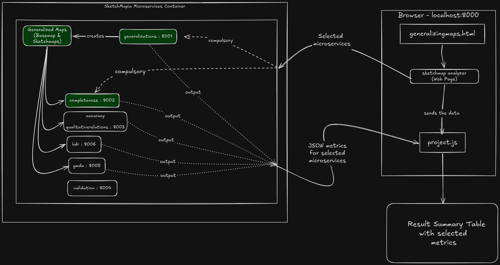
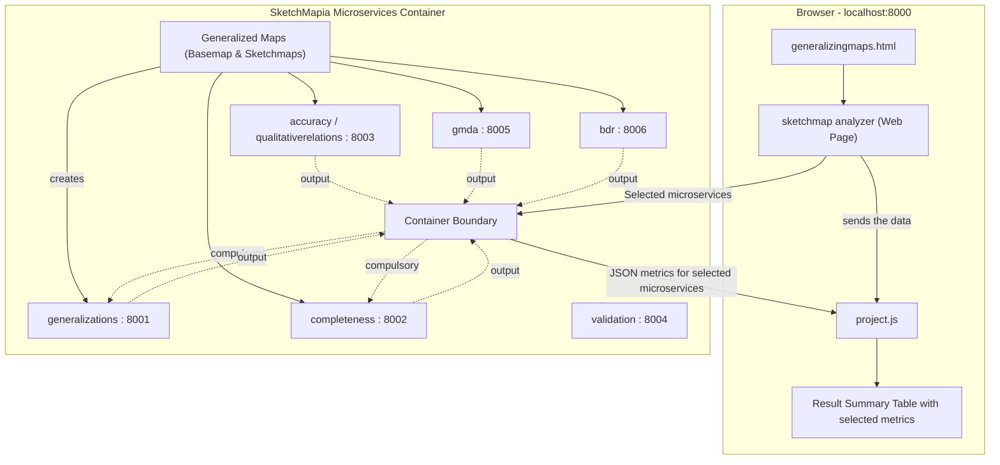
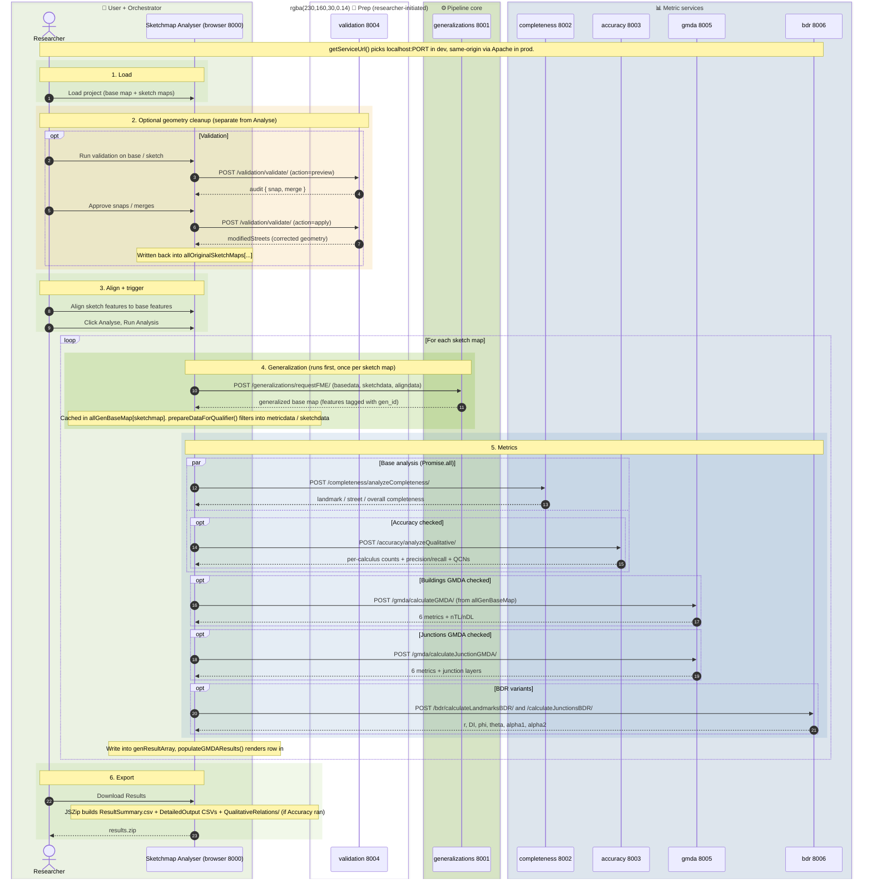

<div align="center">

# 🗺️ SketchMapia Microservices

**A microservice platform for the quantitative analysis of sketch maps**

Developed by the [Spatial Intelligence Lab (SIL)](https://www.uni-muenster.de/Geoinformatics/en/sil/) · Institute for Geoinformatics (IFGI) · University of Münster

[](https://github.com/ifgi-sil/SketchMapia-Microservices/actions/workflows/registry-build-publish.yml)


[](LICENSE)

[Quick Start](#-quick-start) · [Architecture](#-architecture) · [Services](#-services) · [Analysis Features](#-analysis-features) · [API](#-api-reference) · [Deployment](#-deployment) · [Docs](#-documentation)

</div>

---

## 📖 Overview

SketchMapia compares hand-drawn **sketch maps** against reference **base maps** and quantifies how accurately people represent space. A central web application (the *Sketchmap Analyser*) orchestrates a family of independent Django microservices, each implementing one analysis method — from completeness and qualitative spatial relations to the **Gardony Map Drawing Analyzer (GMDA)** and **Bi-Dimensional Regression (BDR)**.

Every service is containerized, published automatically to the GitHub Container Registry, and deployed behind a single HTTPS reverse proxy.

## 🏗 Architecture

Each analysis method lives in its own Django microservice with its own port and URL prefix, orchestrated through Docker Compose. The main application calls the services from the browser — directly via ports in local development, via Apache reverse-proxy paths in production.

<!---<p align="center">
  
</p>-->



### Request Lifecycle


## 🧩 Services

| Service | Port | URL Prefix | Purpose |
| :--- | :---: | :--- | :--- |
| **sketchmap_analyser** | `8000` | `/` | Main web application — sketch map editor, project management, results UI |
| **generalizations** | `8001` | `/generalizations/` | Map generalization processing |
| **completeness** | `8002` | `/completeness/` | Completeness analysis (recalled vs. omitted features) |
| **qualitativerelations** | `8003` | `/accuracy/` | Qualitative spatial relations accuracy (from `accuracy/`) |
| **validation** | `8004` | `/validation/` | Sketch map validation |
| **gmda** | `8005` | `/gmda/` | Gardony Map Drawing Analyzer — six spatial accuracy metrics |
| **bdr** | `8006` | `/bdr/` | Bi-Dimensional Regression — similarity-transform fit and distortion |

## 🚀 Quick Start

```bash
git clone https://github.com/ifgi-sil/SketchMapia-Microservices.git
cd SketchMapia-Microservices
docker-compose up --build
```

1. Open **http://localhost:8000/generalizingmaps/** in your browser.
2. Load a project and click **Analyse**.
3. In the modal, **Completeness** is always included — additionally check **Accuracy**, **Buildings GMDA**, and/or **Junctions GMDA**, then click **Run Analysis**.
4. Results appear as grouped column sets in the results table; only the columns for selected metrics are shown.
5. Click **Download Results** for a zip of all CSV outputs (`ResultSummary.csv`, `CompletenessDetailedOutput.csv`, `GeneralizationDetailedOutput.csv`, `QADetailedOutput.csv`, `GMDADetailedOutput.csv`).

## 🔬 Analysis Features

### Gardony Map Drawing Analyzer (GMDA)

Implementation of the sketch map analysis method from [Gardony, Taylor & Brunyé (2016)](https://link.springer.com/article/10.3758/s13428-014-0556-x), computing six spatial accuracy metrics between a sketch map and its reference map — in two variants:

- **🏠 Landmark-based** — uses polygon features (e.g. buildings). Implements the paper's *Advanced Mode*: each landmark is represented by **8 peripheral points** along its minimum bounding rectangle (instead of a single centroid), capturing position *and* spatial extent/orientation. Feature pairs are aligned via a `SketchAlign` attribute and filtered to strict 1:1 matches using a Union-Find structure.
- **🛣 Junction-based** — uses street junctions detected from road-segment endpoints that coincide across two or more segments. Sketch junctions are matched to base junctions via a **topological subset check** on shared road IDs.

<p align="center">
  
</p>

| Metric | Measures | Penalizes omissions? |
| :--- | :--- | :---: |
| **CanOrg** | Canonical organization — overall N/S/E/W topological accuracy | ✅ |
| **CanAcc** | Canonical accuracy — layout accuracy of drawn landmarks only | ❌ |
| **DistAcc** | Distance accuracy — normalized pairwise distance error | ❌ |
| **ScaBias** | Scaling bias — systematic expansion (+) or compression (−) | ❌ |
| **AngAcc** | Angular accuracy — normalized pairwise angular error | ❌ |
| **RotBias** | Rotational bias — systematic clockwise (+) / counterclockwise (−) rotation | ❌ |

<details>
<summary><b>📐 Metric formulas & combinatorics</b></summary>

#### Combinatorics (Advanced Mode)

With 8 peripheral points per landmark, comparisons between points of the *same* landmark must be excluded. For $n_{TL}$ target landmarks and $n_{DL}$ drawn landmarks:

$$N_{TL} = \binom{8n_{TL}}{2} - n_{TL}\binom{8}{2} \qquad N_{DL} = \binom{8n_{DL}}{2} - n_{DL}\binom{8}{2}$$

#### Formulas

**Canonical Organization** — uses all target pairs as denominator, so omitted landmarks lower the score:

$$CanOrg = \frac{\sum_{i=1}^{N_{TL}} \text{CanonicalScore}_i}{2N_{TL}}$$

**Canonical Accuracy** — denominator switches to drawn pairs, isolating layout accuracy from recall:

$$CanAcc = \frac{\sum_{i=1}^{N_{DL}} \text{CanonicalScore}_i}{2N_{DL}}$$

**Distance Accuracy** — with $dr_{SM}, dr_{TE}$ the scale-equalized distance ratios of sketch map and target environment:

$$DistAcc = 1 - \frac{\sum_{i=1}^{N_{DL}} |dr_{SM, i} - dr_{TE, i}|}{N_{DL}}$$

**Scaling Bias** — signed version of the same comparison:

$$ScaBias = \frac{\sum_{i=1}^{N_{DL}} (dr_{SM, i} - dr_{TE, i})}{N_{DL}}$$

**Angular Accuracy** — absolute angular deviations scaled against the maximum error of $180^\circ$:

$$AngAcc = 1 - \frac{\sum_{i=1}^{N_{DL}} \left| \frac{180}{\pi} ang_{Diff, i} \right|}{180 \cdot N_{DL}}$$

**Rotational Bias** — circular mean via trigonometric summation (`np.arctan2`), gracefully handling the $0^\circ \equiv 360^\circ$ wrap-around:

$$RotBias = \frac{180}{\pi} \text{atan2}\left( \frac{\sum_{i=1}^{N_{DL}} \sin(ang_{Diff, i})}{N_{DL}}, \frac{\sum_{i=1}^{N_{DL}} \cos(ang_{Diff, i})}{N_{DL}} \right)$$

</details>

### Bi-Dimensional Regression (BDR)

A second, independent accuracy method: BDR fits a **similarity transform** (uniform scale, rotation, translation) that best maps the base-map configuration onto the sketch-map configuration by least squares, then measures the residual distortion. It reuses GMDA's 8-point MBR extraction and `SketchAlign` 1:1 alignment pipeline, and comes in the same **Landmarks** / **Junctions** split.

| Metric | Meaning |
| :--- | :--- |
| **r** | Bidimensional correlation — goodness-of-fit of the similarity transform |
| **DI** | Distortion Index — $100\sqrt{1 - r^2}$ |
| **phi** | Fitted uniform scale factor |
| **theta** | Fitted rotation (degrees) |
| **alpha1, alpha2** | Fitted x/y translation |

➡️ Full derivations and implementation notes: [`bdr/README.md`](bdr/README.md)

## 📡 API Reference

Both analysis services accept two GeoJSON feature collections and return metrics as JSON.

| Endpoint | Method | Description |
| :--- | :---: | :--- |
| `/gmda/calculateGMDA/` | `POST` | Landmark-based GMDA |
| `/gmda/calculateJunctionGMDA/` | `POST` | Junction-based GMDA |
| `/bdr/calculateLandmarksBDR/` | `POST` | Landmark-based BDR |
| `/bdr/calculateJunctionsBDR/` | `POST` | Junction-based BDR |

<details>
<summary><b>Request / response format</b></summary>

**Request** (both services):

```text
POST /gmda/calculateGMDA/
Content-Type: application/x-www-form-urlencoded

basemapdata=[GeoJSON string]&sketchmapdata=[GeoJSON string]
```

**Response** (GMDA example):

```json
{
  "CanOrg": 0.0962,
  "CanAcc": 0.8917,
  "ScaBias": -0.0001,
  "DistAcc": 0.9358,
  "RotBias": -30.2334,
  "AngAcc": 0.7942,
  "nTL": 14,
  "nDL": 5
}
```

</details>

## 🚢 Deployment

Production runs on prebuilt images, not source builds:

1. **CI** — every push to `main` triggers [`registry-build-publish.yml`](.github/workflows/registry-build-publish.yml), building and pushing all service images to `ghcr.io/ifgi-sil/<service>:latest`.
2. **Server** — [`docker-compose.server.yml`](docker-compose.server.yml) pulls those images; [Watchtower](https://containrrr.dev/watchtower/) polls the registry and auto-updates running containers.
3. **Reverse proxy** — an Apache vhost ([reference copy](docs/apache-sketchmapia-ssl.conf)) terminates TLS on 443 and proxies each `/service/` path to its localhost port. Service ports are never exposed externally.

Adding a new microservice touches six places (service code, both compose files, CI workflow, frontend port map, Apache vhost) — follow the step-by-step checklist in [**docs/adding-a-new-service.md**](docs/adding-a-new-service.md).

## 📚 Documentation

| Document | Contents |
| :--- | :--- |
| [`docs/adding-a-new-service.md`](docs/adding-a-new-service.md) | Checklist for adding a microservice, with deploy procedure and failure symptoms |
| [`docs/apache-sketchmapia-ssl.conf`](docs/apache-sketchmapia-ssl.conf) | Reference copy of the production Apache vhost |
| [`docker-compose.server.yml`](docker-compose.server.yml) | Reference copy of the production compose file |
| [`docs/gmda-integration-notes.md`](docs/gmda-integration-notes.md) | GMDA implementation details and integration change log |
| [`bdr/README.md`](bdr/README.md) | BDR method background, formulas, and implementation details |

## 📄 Research Background

- Gardony, A. L., Taylor, H. A., & Brunyé, T. T. (2016). *Gardony Map Drawing Analyzer: Software for quantitative analysis of sketch maps.* Behavior Research Methods, 48, 151–177. [doi:10.3758/s13428-014-0556-x](https://link.springer.com/article/10.3758/s13428-014-0556-x)
- Bi-Dimensional Regression as introduced for cognitive-map comparison by Tobler and formalized by Friedman & Kohler (2003).

## 🤝 Contributors

The GMDA and BDR features were built with the help of:

- Clement Amirault — [@CL-77](https://github.com/CL-77)
- Ajay — [@ajay-sheokand](https://github.com/ajay-sheokand)

## ⚖️ License

Released under the [MIT License](LICENSE) © 2023 Spatial Intelligence Lab, Institute for Geoinformatics, University of Münster.
